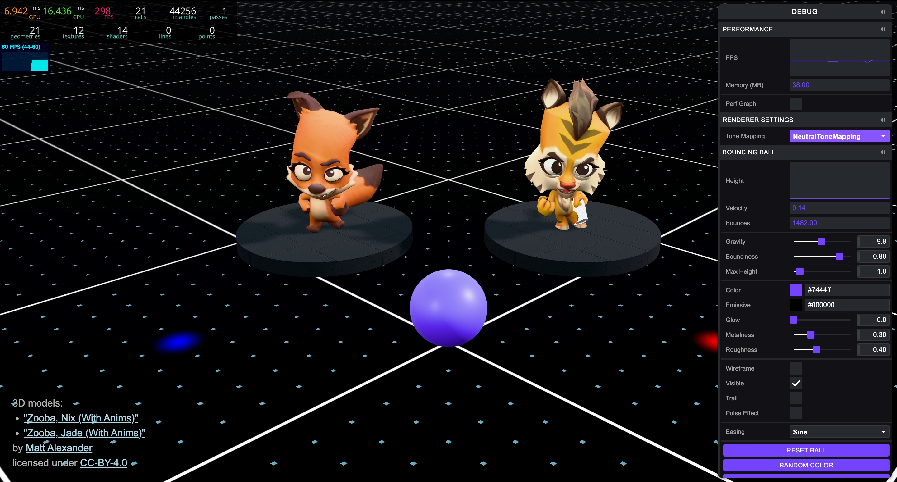

# Three.js Game Development Template

Production-ready Three.js template with modular architecture, asset management, spatial audio, and performance monitoring. Built for developers who want to jump straight into creating 3D games without wrestling with boilerplate.



## Features

- 🎮 **Complete Game Architecture** - Modular entity-component system ready for expansion
- 🎵 **Spatial Audio System** - 3D positional audio with category management and fade controls
- 📦 **Smart Asset Loading** - Support for Draco/KTX2 compression with progress tracking
- 🎨 **Shader Pipeline** - GLSL shader support with hot reload
- 🐛 **Debug Tools** - Performance monitoring, GUI controls, and orientation gizmo
- 🧪 **Dev Environment** - Isolated testing playground for rapid prototyping
- ⚡ **Optimized Build** - Vite-powered with production-ready output
- 🎯 **TypeScript Ready** - Easy migration path with JSDoc support

## Prerequisites

- **Node.js** 16.x or higher
- **npm** 7.x or higher (or yarn/pnpm equivalent)
- Modern browser with WebGL 2.0 support

## Quick Start

```sh
# Clone or download this template
git clone https://github.com/SahilK-027/threejs-gamedev-template.git
cd threejs-gamedev-template

# Install dependencies
npm install

# Start development server
npm run dev
```

Open `http://localhost:5173` in your browser. You should see two animated characters (Jade and Nix) on a stage with background music.

## What's Included

Out of the box, this template includes:

- **Two animated player characters** with cycling animations
- **Interactive stage environment** with lighting and shadows
- **Background music** and sound effects
- **Camera controls** with smooth orbit movement
- **Physics system** ready for collision detection
- **Keyboard input handling** for player controls
- **Audio settings UI** with volume and mute controls

## Available Commands

```sh
npm run dev          # Start development server (main game)
npm run dev:env      # Start dev environment (testing playground)
npm run dev:debug    # Start with debug mode enabled
npm run build        # Build for production
npm run preview      # Preview production build locally
```

## Getting Started with Your Own Project

### Option 1: Build on Top of Examples

Keep the example players and modify them to learn the architecture:

1. Explore `src/Game/Entities/Player1.class.js` and `Player2.class.js`
2. Modify animations, positions, or behaviors
3. Add your own entities following the same pattern

### Option 2: Start Fresh

Remove example content and start with a clean slate:

1. **Remove example players:**
   ```sh
   rm src/Game/Entities/Player1.class.js
   rm src/Game/Entities/Player2.class.js
   ```

2. **Clean up World.scene.js:**
   ```diff
   // src/Game/World/World.scene.js
   - import Player1 from '../Entities/Player1.class';
   - import Player2 from '../Entities/Player2.class';
   
   export default class World {
     constructor() {
   -   this.player1 = new Player1();
   -   this.player2 = new Player2();
     }
   }
   ```

3. **Remove example assets from assets.js:**
   ```diff
   // src/Config/assets.js
   const ASSETS = [
   -  { id: 'player1Model', type: 'gltfModel', path: '/assets/models/jade.glb' },
   -  { id: 'player2Model', type: 'gltfModel', path: '/assets/models/nix.glb' },
   -  { id: 'bgMusic', type: 'audio', path: '/assets/audio/bgm/music.mp3' },
   ];
   ```

4. **Start building your game:**
   - Create new entities in `src/Game/Entities/`
   - Add your models to `public/assets/models/`
   - Define assets in `src/Config/assets.js`
   - Instantiate in `World.scene.js`

### Your First Custom Entity

```js
// src/Game/Entities/MyEntity.class.js
import * as THREE from 'three';
import Game from '../Game.class';

export default class MyEntity {
  constructor() {
    this.game = Game.getInstance();
    this.scene = this.game.scene;
    this.resources = this.game.resources;
    
    this.setup();
  }

  setup() {
    // Create a simple cube
    const geometry = new THREE.BoxGeometry(1, 1, 1);
    const material = new THREE.MeshStandardMaterial({ color: 0x00ff00 });
    this.mesh = new THREE.Mesh(geometry, material);
    
    this.mesh.castShadow = true;
    this.mesh.receiveShadow = true;
    
    this.scene.add(this.mesh);
  }

  update() {
    // Rotate the cube
    this.mesh.rotation.y += 0.01;
  }
}
```

Then add it to your world:

```js
// src/Game/World/World.scene.js
import MyEntity from '../Entities/MyEntity.class';

export default class World {
  constructor() {
    // ... existing code ...
    this.myEntity = new MyEntity();
  }

  update() {
    this.myEntity?.update();
  }
}
```

## Architecture Overview

### Game Loop

The template uses a centralized game loop managed by the `Game` singleton:

```
Game.class.js (Singleton)
├── Time.class.js          → Delta time, elapsed time
├── Sizes.class.js         → Viewport dimensions, resize handling
├── Camera.class.js        → Orbit controls, camera positioning
├── Renderer.class.js      → WebGL renderer, shadow maps
├── ResourceLoader.class.js → Asset loading with progress
├── AudioManager.class.js  → Spatial audio, volume control
├── World.scene.js         → Scene composition
│   ├── Entities/          → Player characters, NPCs
│   ├── Components/        → Reusable 3D objects
│   └── Systems/           → Physics, collision, etc.
└── update() loop          → 60fps game loop
```

### Singleton Pattern

Access the game instance from anywhere:

```js
import Game from './Game/Game.class';

const game = Game.getInstance();
const { scene, camera, renderer, resources, audioManager } = game;
```

### Component Lifecycle

Every component follows this pattern:

1. **Constructor** - Initialize references (game, scene, resources)
2. **setup()** - Create meshes, load assets, configure properties
3. **update()** - Called every frame for animations and logic
4. **destroy()** - (Optional) Cleanup when removing component

## Debug Mode

Add `?mode=debug` to any URL to enable performance monitoring and debug controls:

```
http://localhost:5173/?mode=debug
```

**Debug features include:**

- **Performance Stats** - FPS, memory usage, draw calls, triangles
- **Debug GUI** - Tweakpane controls for live adjustments
- **Orientation Gizmo** - Blender-style axis helper (bottom-right corner)
- **Console Logging** - Detailed asset loading and system info

### Orientation Gizmo

A Blender-style orientation gizmo appears in the bottom-right corner when debug mode or dev environment is active. It shows:

- **Positive axes**: Labeled circles (X, Y, Z) with colored lines
- **Negative axes**: Small colored spheres
- **Colors**: X (pink), Y (cyan), Z (purple)

The gizmo rotates to match your camera orientation, helping you understand the current view angle.

**Customization:**

```js
// src/Game/World/DevEnvironment.scene.js or World.scene.js
this.gizmoHelper = new GizmoHelper({
  alignment: 'bottom-right', // or 'top-left', 'top-right', 'bottom-left'
  axisColors: ['#ff0000', '#00ff00', '#0000ff'], // X, Y, Z colors
  size: 200, // Viewport size in pixels
  margin: 80, // Distance from corner
});
```

## Dev Environment

Isolated testing environment for prototyping 3D objects before integrating them into your game.

Access via `npm run dev:env` or add `?env=dev` to the URL.

**Quick example:**

```js
// src/Game/World/DevEnvironment.scene.js
const cube = new THREE.Mesh(
  new THREE.BoxGeometry(2, 2, 2),
  new THREE.MeshStandardMaterial({ color: 0xff6600 }),
);
this.addTestObject(cube, { rotate: true });
```

### Dev Environment vs Game World

| Feature           | Game World          | Dev Environment       |
| ----------------- | ------------------- | --------------------- |
| Purpose           | Production gameplay | Testing & prototyping |
| Access            | `npm run dev`       | `npm run dev:env`     |
| Players           | ✅ Included         | ❌ Excluded           |
| Lighting          | Game lighting       | Enhanced visibility   |
| Grid              | Basic               | Enhanced with helpers |
| Orientation Gizmo | ✅ (debug mode)     | ✅ Always on          |

**Use Dev Environment for:**

- Prototyping new 3D objects
- Testing materials and animations
- Experimenting with shaders
- Debugging geometry issues

**Use Game World for:**

- Testing gameplay mechanics
- Player interactions
- Performance testing
- Final integration

### Adding Test Objects

```javascript
// src/Game/World/DevEnvironment.scene.js
addExampleObjects() {
  const cube = new THREE.Mesh(
    new THREE.BoxGeometry(2, 2, 2),
    new THREE.MeshStandardMaterial({ color: 0xff6600 })
  );

  this.addTestObject(cube, {
    rotate: true,
    update: (mesh) => {
      mesh.position.y = Math.sin(Date.now() * 0.001) + 1;
    }
  });
}
```

## Project Structure

```
src/
├── Config/
│   └── assets.js                    # Asset definitions and loading config
├── Game/
│   ├── Core/
│   │   ├── Camera.class.js          # Orbit camera with controls
│   │   └── Renderer.class.js        # WebGL renderer setup
│   ├── Entities/
│   │   ├── Player1.class.js         # Example player entity
│   │   └── Player2.class.js         # Example player entity
│   ├── Input/
│   │   └── Keyboard.class.js        # Keyboard input handling
│   ├── Managers/
│   │   ├── AudioManager.class.js    # Spatial audio system
│   │   └── VisibilityManager.class.js # Tab visibility handling
│   ├── Systems/
│   │   └── PhysicsSystem.class.js   # Physics integration point
│   ├── UI/
│   │   └── AudioSettingsUI.class.js # Audio controls UI
│   ├── Utils/
│   │   ├── DebugGUI.class.js        # Tweakpane debug interface
│   │   ├── DebugPane.class.js       # Alternative debug pane
│   │   ├── EventEmitter.class.js    # Event system
│   │   ├── GizmoHelper.class.js     # Orientation gizmo
│   │   ├── Math.class.js            # Math utilities
│   │   ├── Performance.class.js     # FPS and performance stats
│   │   ├── ResourceLoader.class.js  # Asset loading system
│   │   ├── Sizes.class.js           # Viewport size management
│   │   └── Time.class.js            # Delta time and clock
│   ├── World/
│   │   ├── Components/
│   │   │   ├── DebugFloor/          # Debug grid floor
│   │   │   ├── Floor/               # Game floor
│   │   │   ├── Lighting/            # Scene lighting
│   │   │   └── Stage/               # Stage component
│   │   ├── DevEnvironment.scene.js  # Testing environment
│   │   └── World.scene.js           # Main game scene
│   └── Game.class.js                # Main game controller (singleton)
├── Shaders/
│   └── DebugFloor/
│       ├── fragment.glsl            # Fragment shader
│       └── vertex.glsl              # Vertex shader
├── index.js                         # Entry point
└── style.scss                       # Global styles

public/
├── assets/
│   ├── audio/
│   │   ├── ambient/                 # Ambient sounds
│   │   ├── bgm/                     # Background music
│   │   └── sfx/                     # Sound effects
│   ├── models/                      # 3D models (GLB format)
│   └── textures/                    # Textures and materials
├── basis/                           # KTX2 transcoder files
└── draco/                           # Draco decoder files
```

## Core Systems

### Asset Loading

Define assets in `src/Config/assets.js` with support for multiple formats:

```javascript
const ASSETS = [
  // Models (with compression support)
  { id: 'player', type: 'gltfModel', path: '/assets/models/player.glb' },
  {
    id: 'enemy',
    type: 'gltfModelDracoCompressed',
    path: '/assets/models/enemy.glb',
  },

  // Textures
  { id: 'diffuse', type: 'texture', path: '/assets/textures/diffuse.jpg' },
  { id: 'envMap', type: 'HDRITexture', path: '/assets/textures/env.hdr' },

  // Audio
  { id: 'bgMusic', type: 'audio', path: '/assets/audio/bgm/music.mp3' },
];

// Access loaded resources
const game = Game.getInstance();
const model = game.resources.items.player;
const texture = game.resources.items.diffuse;
```

**Supported asset types:**

| Type | Description | Use Case |
|------|-------------|----------|
| `gltfModel` | Standard GLTF/GLB | Uncompressed models |
| `gltfModelDracoCompressed` | Draco compressed | Geometry compression |
| `gltfModelKTX2Compressed` | KTX2 compressed | Texture compression |
| `gltfModelDracoKTX2Compressed` | Both compressions | Maximum optimization |
| `texture` | Standard textures | JPG, PNG images |
| `cubeMap` | Cube map textures | Skyboxes, reflections |
| `HDRITexture` | HDR environment | Realistic lighting |
| `font` | Three.js fonts | 3D text rendering |
| `audio` | Audio files | MP3, OGG, WAV |

**Loading progress:**

```javascript
game.resources.on('progress', (data) => {
  console.log(`Loading: ${data.itemsLoaded}/${data.itemsTotal} (${data.percent.toFixed(0)}%)`);
});

game.resources.on('loaded', () => {
  console.log('All assets loaded!');
});
```

### Audio System

Spatial 3D audio with volume controls, fade effects, and automatic pause/resume on tab visibility changes.

**Basic usage:**

```javascript
const game = Game.getInstance();
const audioManager = game.audioManager;

// Background music
audioManager.playBGM('bgMusic', true, 2.0); // id, loop, fadeIn

// Sound effects
audioManager.playSFX('jumpSound', 0.8); // id, volume

// Master controls
audioManager.setMasterVolume(0.7);
audioManager.setBGMVolume(0.5);
audioManager.setSFXVolume(0.8);
audioManager.setAmbientVolume(0.6);
audioManager.toggleMute();
```

**Audio categories:**

The audio system supports four categories with independent volume control:

- **BGM** - Background music (looping tracks)
- **AMBIENT** - Environmental sounds (wind, rain, birds)
- **NARRATION** - Voice-overs and dialogue
- **SFX** - Sound effects (clicks, jumps, collisions)

**Advanced API with fade effects:**

```javascript
import { AUDIO_CATEGORIES } from './Game/Managers/AudioManager.class';

// Play with fade in
audioManager.play('bgMusic', AUDIO_CATEGORIES.BGM, {
  loop: true,
  fadeIn: 2.0,      // 2 second fade in
  volume: 0.5,
});

// Play ambient sound
audioManager.play('windSound', AUDIO_CATEGORIES.AMBIENT, {
  loop: true,
  fadeIn: 1.0,
  volume: 0.6,
});

// Pause category
audioManager.pause(AUDIO_CATEGORIES.BGM);

// Resume category
audioManager.resume(AUDIO_CATEGORIES.BGM);

// Stop with fade out
audioManager.stop(AUDIO_CATEGORIES.BGM, 2.0); // 2 second fade out

// Category volume control
audioManager.setVolume(AUDIO_CATEGORIES.SFX, 0.7);
audioManager.setVolume('master', 0.8);

// Check if playing
if (audioManager.isPlaying(AUDIO_CATEGORIES.BGM)) {
  console.log('Music is playing');
}
```

**Automatic features:**

- Pauses all audio when tab loses focus
- Resumes audio when tab regains focus
- Respects mute state across visibility changes
- Handles multiple sounds per category (AMBIENT and SFX support multiple simultaneous tracks)

### Animation System

Handle model animations with support for cycling and crossfading:

**Basic animation:**

```javascript
export default class MyCharacter {
  constructor() {
    this.game = Game.getInstance();
    this.modelResource = this.game.resources.items.myModel;
    this.setAnimation();
  }

  setAnimation() {
    this.animation = {};
    this.animation.mixer = new THREE.AnimationMixer(this.modelResource.scene);
    
    // Play single animation
    this.animation.action = this.animation.mixer.clipAction(
      this.modelResource.animations[0]
    );
    this.animation.action.play();
  }

  update() {
    this.animation.mixer.update(this.game.time.delta);
  }
}
```

**Animation cycling with crossfade:**

```javascript
setAnimation() {
  this.animation = {};
  this.animation.mixer = new THREE.AnimationMixer(this.modelResource.scene);
  this.animation.animationIndices = [0, 1, 2, 3]; // Animation indices to cycle
  this.animation.currentIndex = 0;
  this.animation.fadeDuration = 0.5; // Crossfade duration in seconds

  // Listen for animation finish
  this.animation.mixer.addEventListener('finished', () => {
    this.playNextAnimation();
  });

  this.playAnimation(this.animation.animationIndices[0]);
}

playAnimation(index) {
  const newAction = this.animation.mixer.clipAction(
    this.modelResource.animations[index]
  );
  newAction.setLoop(THREE.LoopOnce);
  newAction.clampWhenFinished = true;
  newAction.reset();

  if (this.animation.currentAction) {
    // Smooth crossfade between animations
    newAction.crossFadeFrom(this.animation.currentAction, this.animation.fadeDuration, true);
  }

  newAction.play();
  this.animation.currentAction = newAction;
}

playNextAnimation() {
  this.animation.currentIndex = 
    (this.animation.currentIndex + 1) % this.animation.animationIndices.length;
  this.playAnimation(this.animation.animationIndices[this.animation.currentIndex]);
}
```

### Input System

Keyboard input handling with customizable key bindings:

```javascript
const game = Game.getInstance();
const keyboard = game.keyboard;

// Check key state
if (keyboard.keys['w']) {
  player.moveForward();
}

if (keyboard.keys['space']) {
  player.jump();
}

// Check specific key
if (keyboard.isKeyPressed('l')) {
  console.log('L key is pressed');
}

// Modify key bindings in src/Game/Input/Keyboard.class.js
```

### Physics System

Basic physics system ready for collision detection and rigid body dynamics:

```javascript
// src/Game/Systems/PhysicsSystem.class.js
// Extend this class for your physics needs
// Integrate with libraries like Cannon.js or Rapier
```

## Best Practices

### Performance Optimization

1. **Use compressed models:**
   ```javascript
   // Prefer Draco + KTX2 compression for production
   { id: 'model', type: 'gltfModelDracoKTX2Compressed', path: '/assets/models/model.glb' }
   ```

2. **Dispose of unused resources:**
   ```javascript
   // Clean up geometry and materials
   mesh.geometry.dispose();
   mesh.material.dispose();
   texture.dispose();
   ```

3. **Use object pooling for frequently created/destroyed objects**

4. **Limit draw calls by merging static geometry**

5. **Use texture atlases to reduce texture switches**

### Code Organization

1. **One class per file** - Keep components modular and maintainable
2. **Use the singleton pattern** - Access Game instance consistently
3. **Separate concerns** - Entities, Components, Systems, Utils
4. **Event-driven architecture** - Use EventEmitter for loose coupling
5. **Update lifecycle** - Always implement update() for animated components

### Asset Guidelines

1. **Model optimization:**
   - Keep polygon count reasonable (< 50k triangles per model)
   - Use Draco compression for geometry
   - Use KTX2 compression for textures
   - Bake lighting when possible

2. **Texture optimization:**
   - Use power-of-two dimensions (512, 1024, 2048)
   - Compress textures (JPG for diffuse, PNG for alpha)
   - Use texture atlases for multiple materials
   - Keep texture sizes reasonable (< 2048px for most cases)

3. **Audio optimization:**
   - Use MP3 for music (smaller file size)
   - Use OGG for sound effects (better quality at low bitrates)
   - Keep audio files under 5MB when possible
   - Use mono for positional audio, stereo for music

## Troubleshooting

### Common Issues

**Models not loading:**
- Check file paths in `assets.js` (must start with `/assets/`)
- Verify GLB files are in `public/assets/models/`
- Check browser console for loading errors
- Ensure Draco/KTX2 decoder files are in `public/draco/` and `public/basis/`

**Audio not playing:**
- Check browser autoplay policies (user interaction required)
- Verify audio files are in correct format (MP3, OGG, WAV)
- Check AudioManager initialization in Game.class.js
- Ensure audio context is resumed after user interaction

**Performance issues:**
- Enable debug mode to check FPS and draw calls
- Reduce polygon count in models
- Use compressed textures
- Limit number of lights (max 3-4 for good performance)
- Check for memory leaks (dispose unused resources)

**Black screen on load:**
- Check browser console for errors
- Verify all assets are loading correctly
- Check camera position and target
- Ensure lights are added to scene

**Animations not playing:**
- Verify model has animations (check console logs)
- Ensure animation mixer is updated in update() loop
- Check animation indices are correct
- Verify model is added to scene

### Debug Commands

```javascript
// In browser console
const game = Game.getInstance();

// Check loaded resources
console.log(game.resources.items);

// Check scene objects
console.log(game.scene.children);

// Check camera position
console.log(game.camera.cameraInstance.position);

// Check renderer info
console.log(game.renderer.rendererInstance.info);
```

## Deployment

### Building for Production

```bash
npm run build
```

Output will be in the `dist/` folder. Deploy this folder to any static hosting service:

- **Vercel** - `vercel deploy`
- **Netlify** - Drag and drop `dist/` folder
- **GitHub Pages** - Push `dist/` to `gh-pages` branch
- **AWS S3** - Upload `dist/` contents to S3 bucket

### Environment Variables

Create `.env` file for environment-specific configuration:

```env
VITE_API_URL=https://api.example.com
VITE_DEBUG_MODE=false
```

Access in code:

```javascript
const apiUrl = import.meta.env.VITE_API_URL;
const debugMode = import.meta.env.VITE_DEBUG_MODE === 'true';
```

## Contributing

Contributions are welcome! Please follow these guidelines:

1. Fork the repository
2. Create a feature branch (`git checkout -b feature/amazing-feature`)
3. Commit your changes (`git commit -m '✨ feat: add amazing feature'`)
4. Push to the branch (`git push origin feature/amazing-feature`)
5. Open a Pull Request

## Tech Stack

- **[Three.js](https://threejs.org/)** - 3D rendering engine
- **[Vite](https://vitejs.dev/)** - Build tool with GLSL support
- **[Tweakpane](https://cocopon.github.io/tweakpane/)** - Debug interface
- **[lil-gui](https://lil-gui.georgealways.com/)** - Alternative debug GUI
- **[three-perf](https://github.com/RenaudRohlinger/three-perf)** - Performance monitoring
- **[Draco](https://google.github.io/draco/)** - Geometry compression
- **[KTX2](https://www.khronos.org/ktx/)** - Texture compression
- **[Web Audio API](https://developer.mozilla.org/en-US/docs/Web/API/Web_Audio_API)** - Spatial audio

## Resources

- **[Three.js Documentation](https://threejs.org/docs/)** - Official Three.js docs
- **[Three.js Examples](https://threejs.org/examples/)** - Code examples
- **[Sketchfab](https://sketchfab.com/)** - Free 3D models
- **[Poly Haven](https://polyhaven.com/)** - Free HDRIs and textures
- **[Freesound](https://freesound.org/)** - Free audio samples
- **[glTF Viewer](https://gltf-viewer.donmccurdy.com/)** - Test GLB files
- **[glTF Report](https://gltf.report/)** - Analyze and optimize models

## License

Apache-2.0 License - Permissive reuse with explicit patent grant.

This project is licensed under the Apache License 2.0, which is particularly well-suited for multimedia, audio, and engine code. You're free to:

- Use this template for personal or commercial projects
- Modify and adapt the code to your needs
- Distribute and share your modifications
- Build games and applications without restrictions
- Benefit from explicit patent protection

The Apache-2.0 license provides the same permissive freedoms as MIT while adding an explicit patent grant, protecting you and your users from patent claims. This makes it ideal for game development projects that may involve complex multimedia processing and engine code.

See the [LICENSE](LICENSE) file for full details.

### Asset Licenses

The included 3D models are licensed under CC-BY-4.0 and require attribution:

**Jade Model:**
This work is based on ["Zooba, Jade (With Anims)"](https://sketchfab.com/3d-models/zooba-jade-with-anims-3ddb1b357f3a4b60973cf72dce035e71) by [Matt Alexander](https://sketchfab.com/alexanderfamilytravels) licensed under [CC-BY-4.0](http://creativecommons.org/licenses/by/4.0/)

**Nix Model:**
This work is based on ["Zooba, Nix (With Anims)"](https://sketchfab.com/3d-models/zooba-nix-with-anims-c654d262418249b6b5a679031a6d977c) by [Matt Alexander](https://sketchfab.com/alexanderfamilytravels) licensed under [CC-BY-4.0](http://creativecommons.org/licenses/by/4.0/)

If you use these models in your project, you must credit the original author. Commercial use is allowed with proper attribution. Check `public/assets/models/` for individual license files.

Happy Game Development! 🎮✨
