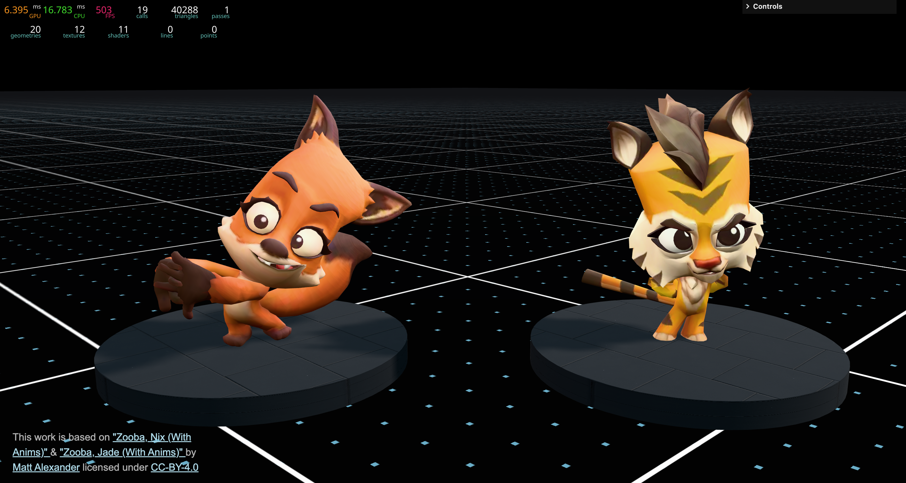

# Three.js Game Development Template

Three.js template for game development with a well-structured architecture, asset management, performance monitoring, and debugging tools.



## 🚀 Quick Start

### Prerequisites

- Node.js 18+
- npm

### Installation

```bash
# Clone the repository
git clone https://github.com/SahilK-027/threejs-gamedev-template.git
cd threejs-gamedev-template

# Install dependencies
npm ci

# Start development server
npm run dev
```

### Build for Production

```bash
npm run build
npm run preview
```

### Debug Mode

Add `?mode=debug` to the URL to enable debug mode with performance monitoring and GUI controls.

## 📁 Project Structure

```
threejs-gamedev-template/
├── public/
│   ├── assets/
│   │   ├── audio/
│   │   │   ├── ambient/                    # Ambient audio loops
│   │   │   ├── bgm/                        # Background music
│   │   │   └── sfx/                        # Sound effects
│   │   ├── models/                         # 3D models (GLB with compression)
│   │   └── textures/                       # Textures (environment maps, materials)
│   ├── basis/                              # Basis Universal transcoder (KTX2)
│   └── draco/                              # Draco decoder files
│
├── src/
│   ├── Config/
│   │   └── assets.js                       # Asset definitions
│   │
│   ├── Game/
│   │   ├── Core/
│   │   │   ├── Camera.class.js             # Camera with OrbitControls
│   │   │   └── Renderer.class.js           # WebGL renderer setup
│   │   │
│   │   ├── Entities/
│   │   │   ├── Player1.class.js            # Player 1 entity
│   │   │   └── Player2.class.js            # Player 2 entity
│   │   │
│   │   ├── Input/
│   │   │   └── Keyboard.class.js           # Keyboard input management
│   │   │
│   │   ├── Managers/
│   │   │   ├── AudioManager.class.js       # Audio system with spatial audio
│   │   │   └── VisibilityManager.class.js  # Tab visibility management
│   │   │
│   │   ├── Systems/
│   │   │   └── PhysicsSystem.class.js      # Physics and collision detection
│   │   │
│   │   ├── UI/
│   │   │   └── AudioSettingsUI.class.js    # Audio controls UI
│   │   │
│   │   ├── Utils/
│   │   │   ├── DebugGUI.class.js           # lil-gui debug interface
│   │   │   ├── DebugPane.class.js          # Tweakpane debug interface
│   │   │   ├── EventEmitter.class.js       # Event system
│   │   │   ├── Math.class.js               # Math utilities
│   │   │   ├── Performance.class.js        # Performance monitoring
│   │   │   ├── ResourceLoader.class.js     # Asset loading with progress
│   │   │   ├── Sizes.class.js              # Responsive sizing
│   │   │   └── Time.class.js               # Animation timing
│   │   │
│   │   ├── World/
│   │   │   ├── Components/
│   │   │   │   ├── BouncingBall/           # Bouncing ball component
│   │   │   │   ├── DebugFloor/             # Custom shader floor
│   │   │   │   ├── Lighting/               # Scene lighting
│   │   │   │   └── Stage/                  # Stage component
│   │   │   └── World.scene.js              # Main world scene
│   │   │
│   │   └── Game.class.js                   # Main game controller (singleton)
│   │
│   ├── Shaders/
│   │   └── DebugFloor/                     # Custom GLSL shaders
│   │
│   ├── index.js                            # Application entry point
│   └── style.scss                          # Global styles
│
├── index.html
├── package.json
└── vite.config.js
```

## 🎯 Core Components

### Game Engine (`Game.class.js`)

Singleton orchestrator managing the game loop, scene, camera, renderer, and world.

```javascript
const game = new Game(canvas, resources, isDebugMode);

// Access anywhere via singleton
const game = Game.getInstance();
const { scene, camera, renderer, world } = game;
```

### Resource Loader

Asset management with progress tracking and support for multiple formats including textures, models, fonts, and audio.

```javascript
// Define assets in src/Config/assets.js
const ASSETS = [
  // 3D Models with various compression options
  {
    id: 'player1Model',
    type: 'gltfModel', // Uncompressed GLTF
    path: '/assets/models/model.glb',
  },
  {
    id: 'player2Model',
    type: 'gltfModelDracoCompressed', // Draco geometry compression
    path: '/assets/models/model_draco.glb',
  },
  {
    id: 'player3Model',
    type: 'gltfModelKTX2Compressed', // KTX2 texture compression
    path: '/assets/models/model_ktx2.glb',
  },
  {
    id: 'player4Model',
    type: 'gltfModelDracoKTX2Compressed', // Both Draco + KTX2
    path: '/assets/models/model_full.glb',
  },

  // Textures
  {
    id: 'diffuseMap',
    type: 'texture', // Standard textures (JPG, PNG)
    path: '/assets/textures/diffuse.jpg',
  },
  {
    id: 'envMap',
    type: 'cubeMap', // Environment cube maps
    path: ['/px.jpg', '/nx.jpg', '/py.jpg', '/ny.jpg', '/pz.jpg', '/nz.jpg'],
  },
  {
    id: 'hdriMap',
    type: 'HDRITexture', // HDR environment maps
    path: '/assets/textures/environment.hdr',
  },

  // Fonts
  {
    id: 'mainFont',
    type: 'font', // Three.js JSON fonts
    path: '/assets/fonts/font.json',
  },

  // Audio
  {
    id: 'bgMusic',
    type: 'audio', // Audio files (MP3, OGG, WAV)
    path: '/assets/audio/bgm/music.mp3',
  },
  {
    id: 'jumpSound',
    type: 'audio',
    path: '/assets/audio/sfx/jump.mp3',
  },
];

// Load with progress events
const resources = new ResourceLoader(ASSETS);
resources.on('progress', ({ percent }) => console.log(`${percent}%`));
resources.on('loaded', () => initGame());

// Access loaded resources
const model = resources.items.player1Model;
const audioBuffer = resources.items.bgMusic;
```

### Audio Manager

Comprehensive audio system with spatial audio, volume control, and automatic pause/resume.

```javascript
// Initialize (automatically done in Game.class.js)
const audioManager = new AudioManager();

// Play background music
audioManager.playBGM('bgMusic', { volume: 0.5, loop: true });

// Play sound effect
audioManager.playSFX('jumpSound', { volume: 0.8 });

// Play positional 3D audio
const sound = audioManager.playPositionalSFX('footstep', playerMesh, {
  volume: 0.6,
  refDistance: 5,
  rolloffFactor: 2,
});

// Control playback
audioManager.pauseBGM();
audioManager.resumeBGM();
audioManager.stopAllSounds();

// Volume control
audioManager.setMasterVolume(0.7);
audioManager.setBGMVolume(0.5);
audioManager.setSFXVolume(0.8);

// Mute/unmute
audioManager.toggleMute();
audioManager.mute();
audioManager.unmute();
```

### Event System

Decoupled communication between components.

```javascript
// Subscribe
this.on('eventName', (data) => handleEvent(data));

// Emit
this.trigger('eventName', { key: 'value' });
```

## 🎮 Adding New Features

### Creating a World Component

```javascript
// src/Game/World/Components/MyComponent/MyComponent.class.js
import * as THREE from 'three';
import Game from '../../../Game.class';

export default class MyComponent {
  constructor() {
    this.game = Game.getInstance();
    this.scene = this.game.scene;
    this.resources = this.game.resources;
    this.setup();
  }

  setup() {
    // Initialize component
  }

  update() {
    // Called each frame
  }
}
```

## 🔧 Tech Stack

- **Three.js** - 3D rendering
- **Vite** - Build tool with GLSL plugin
- **Tweakpane / lil-gui** - Debug interfaces
- **three-perf** - Performance monitoring
- **Sass** - Styling
- **Draco** - Geometry compression
- **Basis Universal (KTX2)** - Texture compression
- **Web Audio API** - Spatial audio system

## ✨ Features

- 🎮 **Game Loop** - Optimized update/render cycle with delta time
- 📦 **Asset Management** - Multi-format resource loader with progress tracking
- 🎵 **Audio System** - Spatial 3D audio with volume controls and auto-pause
- 🎨 **Custom Shaders** - GLSL shader support with Vite plugin
- 📊 **Performance Monitoring** - Real-time FPS and memory tracking
- 🐛 **Debug Tools** - Tweakpane and lil-gui integration
- 📱 **Responsive** - Automatic canvas resizing
- ⚡ **Optimized Assets** - Draco geometry + KTX2 texture compression
- 🎯 **Physics System** - Collision detection and response
- ⌨️ **Input Management** - Keyboard controls
- 🔊 **Audio UI** - Built-in volume controls and mute toggle
- 👁️ **Visibility Management** - Auto-pause when tab is hidden

## 🙏 Acknowledgments

- [Three.js](https://threejs.org/) - 3D library
- [Vite](https://vitejs.dev/) - Build tool
- [lil-gui](https://lil-gui.georgealways.com/) - Debug GUI
- [Tweakpane](https://tweakpane.github.io/docs/) - Debug pane
- [three-perf](https://github.com/utsuboco/three-perf) - Performance monitoring
- [Draco](https://google.github.io/draco/) - Geometry compression
- [Basis Universal](https://github.com/BinomialLLC/basis_universal) - Texture compression

## 📚 Documentation

For detailed documentation on specific systems:

- [AudioManager README](./src/Game/Managers/AudioManager.README.md) - API reference

**Happy Game Development! 🎮✨**
